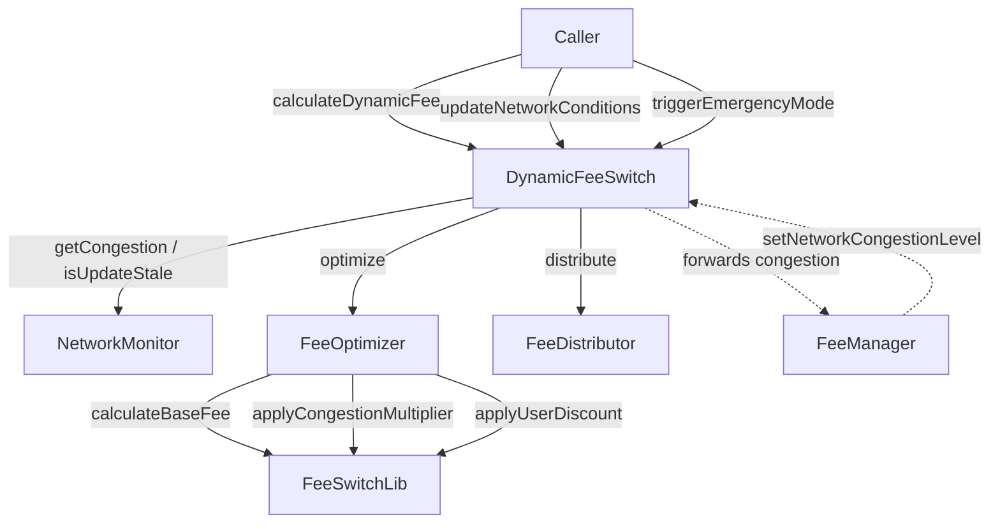

# Design Document: Dynamic Fee Switching

## Overview

The Dynamic Fee Switching system replaces static fee models with a real-time responsive mechanism that adjusts transaction fees based on network congestion, user loyalty metrics, and configurable fee tier boundaries. The primary entry point is the `DynamicFeeSwitch` contract, which orchestrates four collaborating components: `NetworkMonitor`, `FeeOptimizer`, `FeeSwitchLib`, and `FeeDistributor`.

The design extends the existing `FeeManager` infrastructure rather than replacing it. `DynamicFeeSwitch` acts as a specialized facade that implements the `IDynamicFeeSwitch` interface and delegates to the existing fee calculation pipeline. It also introduces an emergency mode that bypasses all dynamic logic and returns a fixed safe fee value.

Key design goals:
- Fee values always stay within configured `FeeTier` bounds (`minFeeBps`–`maxFeeBps`)
- Network condition updates are validated and tracked for staleness
- Emergency mode is a hard override with no side effects on stored state
- Fee distribution is auditable and enforces 100% allocation invariant

---

## Architecture



### Component Responsibilities

| Component | Responsibility |
|---|---|
| `DynamicFeeSwitch` | Orchestration, input validation, emergency mode, event emission |
| `NetworkMonitor` | Stores congestion level and block time; reports staleness |
| `FeeOptimizer` | Composes `FeeSwitchLib` calls to produce a final fee value |
| `FeeSwitchLib` | Pure, stateless fee math (base fee, congestion multiplier, user discount) |
| `FeeDistributor` | Splits collected fees among recipients; enforces 100% allocation |
| `IDynamicFeeSwitch` | Stable public interface; exports `NetworkConditions`, `UserMetrics`, `FeeTier` types |

---

## Components and Interfaces

### IDynamicFeeSwitch (updated interface)

```typescript
export interface NetworkConditions {
  congestionLevel: number;       // 0–100
  lastUpdatedTimestamp: number;  // Unix ms
  averageBlockTime: number;      // seconds, > 0
}

export interface UserMetrics {
  tradeVolume30d: number;        // USD equivalent, >= 0
  interactionScore: number;      // 0–100
}

export interface FeeTier {
  baseFeeBps: number;
  minFeeBps: number;
  maxFeeBps: number;
}

export interface IDynamicFeeSwitch {
  calculateDynamicFee(userAddress: string, transactionVolume: number): number;
  updateNetworkConditions(conditions: NetworkConditions): void;
  triggerEmergencyMode(isEmergency: boolean, safeFeeBps: number): void;
}
```

### DynamicFeeSwitch

Implements `IDynamicFeeSwitch`. Holds:
- `NetworkMonitor` instance
- `FeeDistributor` instance
- `emergencyMode: boolean`
- `safeFeeBps: number`
- Configured `FeeTier[]` sorted by volume threshold

Key methods:
- `calculateDynamicFee(userAddress, transactionVolume)` — validates inputs, checks emergency mode, selects tier, delegates to `FeeOptimizer`, clamps result to tier bounds, emits event
- `updateNetworkConditions(conditions)` — validates congestion range and block time, delegates to `NetworkMonitor`
- `triggerEmergencyMode(isEmergency, safeFeeBps)` — validates `safeFeeBps > 0` when activating, sets state, emits event

### NetworkMonitor

Stores `congestionLevel` (0–100, integer) and `lastUpdate` timestamp. Exposes:
- `updateCongestion(level, averageBlockTime)` — stores both values
- `getCongestion(): number`
- `getAverageBlockTime(): number`
- `isUpdateStale(): boolean` — true when `Date.now() - lastUpdate > STALENESS_THRESHOLD_MS` (30 000 ms)

### FeeOptimizer

Stateless. Single static method:
```typescript
static optimize(volume: number, congestion: number, userActivity: number): number
```
Calls `FeeSwitchLib.calculateBaseFee → applyCongestionMultiplier → applyUserDiscount` in sequence.

### FeeSwitchLib

Pure functions, no state:
- `calculateBaseFee(volume): number` — returns bps value decreasing monotonically with volume
- `applyCongestionMultiplier(baseFee, congestion): number` — adds at most 50% of base fee at congestion=100
- `applyUserDiscount(fee, activityScore): number` — subtracts at most 20% of fee at score=100

### FeeDistributor

Stateful. Holds per-recipient balances. Methods:
- `configure(recipients: Recipient[])` — validates sum of allocations equals 10 000 bps
- `distribute(amount: number)` — splits amount, records per-recipient amounts and timestamp
- `getTreasuryBalance(): number`
- `getRewardsPoolBalance(): number`

---

## Data Models

### NetworkConditions

```typescript
interface NetworkConditions {
  congestionLevel: number;      // integer, 0–100 inclusive
  lastUpdatedTimestamp: number; // Unix ms, set by caller
  averageBlockTime: number;     // seconds, must be > 0
}
```

### UserMetrics

```typescript
interface UserMetrics {
  tradeVolume30d: number;   // >= 0
  interactionScore: number; // integer, 0–100
}
```

### FeeTier

```typescript
interface FeeTier {
  baseFeeBps: number; // must be in [minFeeBps, maxFeeBps]
  minFeeBps: number;  // must be <= maxFeeBps
  maxFeeBps: number;
}
```

Invariant: `minFeeBps <= baseFeeBps <= maxFeeBps`

### EmergencyModeEvent

```typescript
interface EmergencyModeEvent {
  isEmergency: boolean;
  safeFeeBps: number;
  timestamp: number;
}
```

### DistributionRecord

```typescript
interface DistributionRecord {
  timestamp: number;
  totalAmount: number;
  recipients: Array<{ address: string; amount: number }>;
}
```

### Recipient

```typescript
interface Recipient {
  address: string;
  allocationBps: number; // basis points; all recipients must sum to 10 000
  name: string;
}
```

---

## Correctness Properties

*A property is a characteristic or behavior that should hold true across all valid executions of a system — essentially, a formal statement about what the system should do. Properties serve as the bridge between human-readable specifications and machine-verifiable correctness guarantees.*

### Property 1: Fee stays within tier bounds

*For any* valid `userAddress`, `transactionVolume > 0`, and configured `FeeTier`, when `calculateDynamicFee` is called in normal mode, the returned fee value in bps must satisfy `minFeeBps <= fee <= maxFeeBps`.

**Validates: Requirements 1.1, 3.5**

---

### Property 2: Congestion multiplier is bounded

*For any* base fee value and congestion level in [0, 100], `applyCongestionMultiplier` must return a value in the range `[baseFee, baseFee * 1.5]`.

**Validates: Requirements 1.2, 6.5**

---

### Property 3: Zero congestion is identity

*For any* base fee value, calling `applyCongestionMultiplier` with congestion = 0 must return the base fee unchanged.

**Validates: Requirements 6.2**

---

### Property 4: Zero activity score is identity

*For any* fee value, calling `applyUserDiscount` with `activityScore = 0` must return the fee unchanged.

**Validates: Requirements 1.3, 6.3**

---

### Property 5: Fee pipeline composition stays in bounds

*For any* valid volume, congestion in [0, 100], and activityScore in [0, 100], applying `calculateBaseFee → applyCongestionMultiplier → applyUserDiscount` in sequence must produce a result within the active `FeeTier` bounds after clamping.

**Validates: Requirements 6.4**

---

### Property 6: Base fee decreases monotonically with volume

*For any* two volumes `v1 < v2` that fall in different volume brackets, `calculateBaseFee(v1) >= calculateBaseFee(v2)`.

**Validates: Requirements 6.1**

---

### Property 7: Emergency mode returns safe fee for all inputs

*For any* `userAddress` and `transactionVolume > 0`, when the contract is in emergency mode with `safeFeeBps = S`, every call to `calculateDynamicFee` must return exactly `S`.

**Validates: Requirements 4.1, 4.2**

---

### Property 8: Emergency mode round-trip restores normal calculation

*For any* contract state, activating emergency mode then deactivating it must result in `calculateDynamicFee` returning the same value it would have returned before emergency mode was activated.

**Validates: Requirements 4.3**

---

### Property 9: Distribution allocation invariant

*For any* distribution configuration, the sum of all recipient `allocationBps` values must equal exactly 10 000 before `distribute` is accepted.

**Validates: Requirements 5.2**

---

### Property 10: Distribution amount round-trip

*For any* fee amount `A > 0` distributed via `FeeDistributor`, the sum of all per-recipient amounts recorded must equal `A`.

**Validates: Requirements 5.1, 5.4**

---

### Property 11: Valid network conditions are accepted

*For any* `NetworkConditions` with `congestionLevel` in [0, 100] and `averageBlockTime > 0`, `updateNetworkConditions` must succeed and the stored congestion level must equal the provided value.

**Validates: Requirements 2.1, 2.3**

---

### Property 12: Invalid congestion is rejected

*For any* `congestionLevel` outside [0, 100], `updateNetworkConditions` must reject the update with a descriptive error and leave the stored congestion level unchanged.

**Validates: Requirements 2.2**

---

### Property 13: Staleness detection

*For any* stored `NetworkConditions` whose age exceeds 30 seconds, `NetworkMonitor.isUpdateStale()` must return `true`; for conditions updated within 30 seconds it must return `false`.

**Validates: Requirements 2.4, 2.5**

---

### Property 14: FeeTier invariant enforcement

*For any* `FeeTier` where `minFeeBps > maxFeeBps` or `baseFeeBps` is outside `[minFeeBps, maxFeeBps]`, the configuration call must be rejected with a descriptive error.

**Validates: Requirements 3.2, 3.3**

---

## Error Handling

| Condition | Component | Behavior |
|---|---|---|
| `congestionLevel` outside [0, 100] | `DynamicFeeSwitch` / `NetworkMonitor` | Throw `RangeError` with message |
| `averageBlockTime <= 0` | `NetworkMonitor` | Throw `RangeError` |
| `userAddress` is empty string | `DynamicFeeSwitch` | Throw `ValidationError` |
| `transactionVolume <= 0` | `DynamicFeeSwitch` | Throw `ValidationError` |
| `safeFeeBps = 0` when activating emergency | `DynamicFeeSwitch` | Throw `ValidationError` |
| `minFeeBps > maxFeeBps` in tier config | `DynamicFeeSwitch` | Throw `ValidationError` |
| `baseFeeBps` outside `[min, max]` in tier config | `DynamicFeeSwitch` | Throw `ValidationError` |
| Distribution allocations don't sum to 10 000 | `FeeDistributor` | Throw `ValidationError` |
| `distribute` called with amount <= 0 | `FeeDistributor` | Throw `ValidationError` |
| Stale network conditions (warning only) | `DynamicFeeSwitch` | `console.warn`, proceed with last known value |

All errors include a descriptive message identifying the invalid parameter and its value.

---

## Testing Strategy

### Dual Testing Approach

Both unit tests and property-based tests are required. They are complementary:
- Unit tests verify specific examples, integration points, and error conditions
- Property tests verify universal correctness across randomized inputs

### Property-Based Testing

Library: **fast-check** (TypeScript)

Each property test runs a minimum of **100 iterations**.

Each test is tagged with a comment in the format:
```
// Feature: dynamic-fee-switching, Property N: <property text>
```

Each correctness property defined above maps to exactly one property-based test.

Example structure:
```typescript
import fc from 'fast-check';

// Feature: dynamic-fee-switching, Property 1: Fee stays within tier bounds
it('fee stays within tier bounds for all valid inputs', () => {
  fc.assert(
    fc.property(
      fc.string({ minLength: 1 }),   // userAddress
      fc.float({ min: 0.01 }),       // transactionVolume
      (userAddress, volume) => {
        const fee = switch_.calculateDynamicFee(userAddress, volume);
        expect(fee).toBeGreaterThanOrEqual(activeTier.minFeeBps);
        expect(fee).toBeLessThanOrEqual(activeTier.maxFeeBps);
      }
    ),
    { numRuns: 100 }
  );
});
```

### Unit Testing

Focus areas:
- Emergency mode activation/deactivation with specific `safeFeeBps` values
- Exact fee values for known volume/congestion/score combinations
- Error messages for each invalid input case
- `FeeDistributor.configure` rejection when allocations don't sum to 10 000
- `NetworkMonitor` staleness boundary (exactly at 30 000 ms)
- `FeeManager` backward compatibility: forwarding `NetworkCongestionData` to `DynamicFeeSwitch`

### Test File Locations

- `tests/fees/DynamicFeeSwitch.test.ts` — integration tests for `DynamicFeeSwitch`
- `tests/fees/FeeSwitchLib.test.ts` — unit + property tests for pure library functions
- `tests/fees/NetworkMonitor.test.ts` — unit tests for staleness and congestion storage
- `tests/fees/FeeDistributor.test.ts` — unit + property tests for distribution invariants
